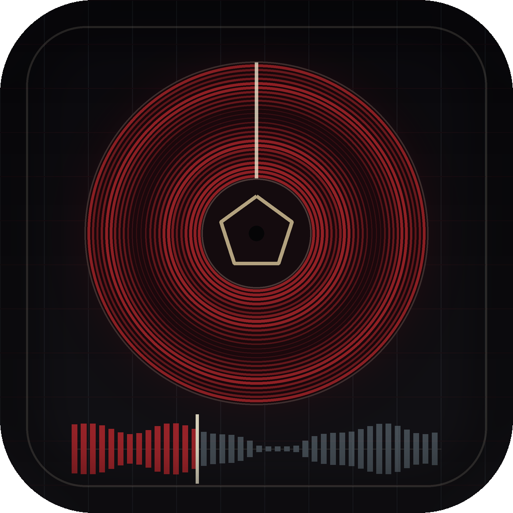

<p align="center">
  
</p>

# Cody Cartridge

A local-first Mac music player styled as a noir hardware deck — a forensic
audio terminal for people with large local libraries and no interest in the
cloud. Electron + React + TypeScript.

**Live demo:** <https://sachittumuluri.github.io/cody-cartridge/> — ships with
the SIGNAL TEST pack, five original synthesized studies (house, build/drop,
drum-and-bass, half-time sub, beatless drone) that exercise every instrument
on the deck. Import your own files to go further; nothing leaves the browser.

**The deck remembers.** Every song you load gets a *body*: the app decodes the
audio once and traces a "spectral spine" — the full track reduced to a 240-column
energy/band signature with estimated BPM and brightness. That trace becomes the
seek bar (you can see the drop before you reach it), a signal lane under every
catalog row, and — for tracks with no cover art — a generated "pressing" whose
grooves, palette, and glyph are derived from the music itself.

## What's inside

- **Signal identities** — per-track pressings, archive-plate hero textures, and
  BPM-synced motion, all computed locally from the audio
- **Real instrumentation** — a live Web Audio graph drives the spectrum bank
  (log-spaced dB mapping with true ballistics), twin glass-face VU meters
  (click to cycle VU / WIDTH / LOUD / SPEC), and a machined AMP knob with a
  real gain + low-shelf warmth stage
- **Mechanical transition grammar** — play locks the signal into alignment,
  pause freezes the trace while the glow decays, skips wind the tape,
  favorites stamp, repeat loops the progress line back through the machine
- **The archive shelf** — dense 44px signal-strip rows, a scanner beam driven
  by the real fingerprinting queue, horizontal row actions, a FIND query
  language (`artist:`, `missing:cover`, `tag:gap`, `match:<80`, `fav:yes`),
  and a three-state drag-resizable layout
- **YouTube Music Takeout matching** — drop your Takeout CSV and the deck
  fuzzy-matches it against your local files, scores confidence per track, and
  renders the unmatched remainder as a ghost library of missing signals
- **Interference control** — OFF is a crisp archival workstation; MAX is an
  intercepted broadcast with grain, chromatic fringe, tears, and dropouts

## Running it

```bash
npm install
npm run web      # browser preview at http://127.0.0.1:5173
npm run dev      # Electron shell against the dev server
npm run build    # typecheck + production bundle
```

Dev convenience: audio in `~/Desktop/music` and Takeout exports in
`~/Desktop/Takeout` are picked up automatically (never in Mac App Store
builds, which are picker-only and sandboxed).

## Posture

Local-only by design. No network entitlement, no scraping, no downloading, no
telemetry — playback, analysis, artwork generation, and Takeout matching all
run on-device against files you already own. Play counts and traces live in
local storage and never leave the machine.

`APP_STORE_READINESS.md` documents the Mac App Store compliance pipeline
(smokes, screenshot capture, signing/packaging checks — see `package.json`
scripts).
